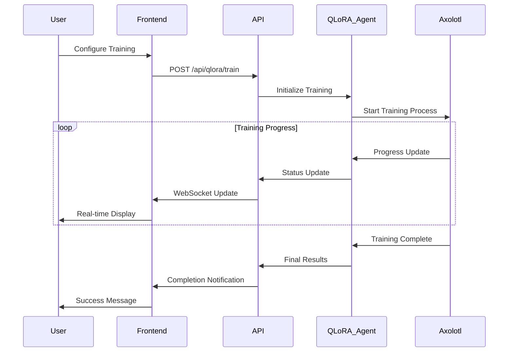
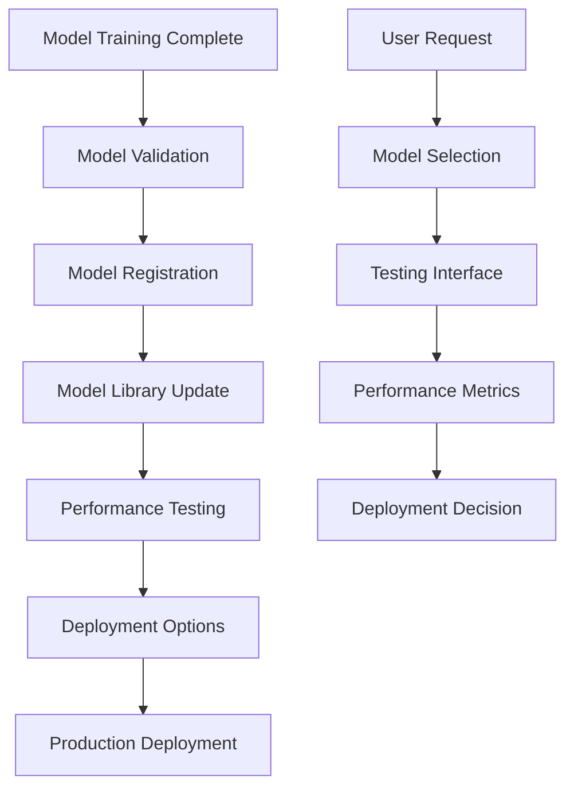

# Phase 10: QLoRA Frontend Integration - Comprehensive Implementation Plan

## Overview

Phase 10 focuses on creating a comprehensive frontend interface for QLoRA (Quantized Low-Rank Adaptation) fine-tuning capabilities. Building upon the robust backend infrastructure established in Phase 8, this phase will deliver an intuitive, user-friendly web interface that makes advanced AI model training accessible to non-technical users.

## 🎯 Project Goals

### Primary Objectives
1. **User-Friendly QLoRA Training Interface**: Create intuitive UI for model training workflows
2. **Real-Time Training Monitoring**: Implement live progress tracking and visualization
3. **Model Management System**: Build comprehensive model lifecycle management
4. **Seamless Integration**: Connect QLoRA features with existing pipeline workflows
5. **Educational Interface**: Provide guided training experiences for Islamic content

### Success Metrics
- ✅ Non-technical users can initiate QLoRA training
- ✅ Real-time training progress visualization
- ✅ Model performance comparison tools
- ✅ Integrated workflow from content processing to model deployment
- ✅ Comprehensive training analytics and reporting

## 🏗️ Architecture Overview

### Frontend Architecture
```
QLoRA Frontend Architecture
├── Training Dashboard
│   ├── Training Job Management
│   ├── Real-time Progress Monitoring
│   ├── Resource Usage Visualization
│   └── Training History
├── Model Management
│   ├── Model Library
│   ├── Performance Comparison
│   ├── Deployment Controls
│   └── Testing Interface
├── Configuration Management
│   ├── Training Parameters
│   ├── Dataset Configuration
│   ├── Hardware Settings
│   └── Islamic Content Validation
└── Integration Components
    ├── Pipeline Integration
    ├── Data Flow Management
    ├── API Connectors
    └── WebSocket Handlers
```

### Backend API Extensions
```
API Endpoints (New)
├── /api/qlora/
│   ├── POST /train - Start training job
│   ├── GET /status/{job_id} - Training status
│   ├── DELETE /stop/{job_id} - Stop training
│   ├── GET /jobs - List all jobs
│   └── GET /metrics/{job_id} - Training metrics
├── /api/models/
│   ├── GET / - List trained models
│   ├── GET /{model_id} - Model details
│   ├── POST /{model_id}/deploy - Deploy model
│   ├── POST /{model_id}/test - Test model
│   └── DELETE /{model_id} - Delete model
├── /api/config/
│   ├── GET /templates - Training templates
│   ├── POST /validate - Validate configuration
│   └── GET /hardware - Hardware capabilities
└── /ws/qlora - WebSocket for real-time updates
```

## 📋 Detailed Implementation Plan

### Phase 10.1: Foundation & Core Components (Week 1-2)

#### 10.1.1 Project Setup
- **Create QLoRA-specific components structure**
  ```
  frontend_web/src/
  ├── components/qlora/
  │   ├── TrainingDashboard.js
  │   ├── ModelManager.js
  │   ├── ConfigurationPanel.js
  │   ├── ProgressMonitor.js
  │   └── MetricsVisualization.js
  ├── pages/qlora/
  │   ├── QLoRAHome.js
  │   ├── TrainingPage.js
  │   ├── ModelsPage.js
  │   └── SettingsPage.js
  ├── services/qlora/
  │   ├── qloraApi.js
  │   ├── websocketService.js
  │   └── configService.js
  └── hooks/qlora/
      ├── useTrainingStatus.js
      ├── useModelManagement.js
      └── useQLoRAConfig.js
  ```

#### 10.1.2 Backend API Extensions
- **Extend existing FastAPI with QLoRA endpoints**
  - Training job management endpoints
  - Model lifecycle management
  - Configuration validation
  - Real-time status updates

#### 10.1.3 WebSocket Integration
- **Real-time communication setup**
  - Training progress updates
  - Resource usage monitoring
  - Error notifications
  - Completion alerts

### Phase 10.2: Training Interface Development (Week 3-4)

#### 10.2.1 Training Dashboard
- **Core Features**:
  - Training job creation wizard
  - Active training monitoring
  - Training queue management
  - Resource allocation display

- **UI Components**:
  ```jsx
  <TrainingDashboard>
    <TrainingJobCard />
    <ProgressVisualization />
    <ResourceMonitor />
    <TrainingQueue />
  </TrainingDashboard>
  ```

#### 10.2.2 Configuration Interface
- **Training Parameters Panel**:
  - Model selection (base models)
  - LoRA hyperparameters (r, alpha, dropout)
  - Training settings (epochs, batch size, learning rate)
  - Islamic content validation settings

- **Dataset Configuration**:
  - Training data selection
  - Data preprocessing options
  - Validation split configuration
  - Quality filters

#### 10.2.3 Progress Monitoring
- **Real-time Visualizations**:
  - Training loss curves
  - Validation metrics
  - Resource usage graphs
  - ETA calculations

- **Interactive Features**:
  - Pause/resume training
  - Adjust parameters mid-training
  - Save checkpoints
  - Early stopping controls

### Phase 10.3: Model Management System (Week 5-6)

#### 10.3.1 Model Library
- **Model Catalog Interface**:
  - Grid/list view of trained models
  - Model metadata display
  - Performance metrics summary
  - Training history

- **Model Details View**:
  - Comprehensive model information
  - Training configuration used
  - Performance benchmarks
  - Usage statistics

#### 10.3.2 Model Testing Interface
- **Interactive Testing**:
  - Prompt input interface
  - Response generation
  - Islamic content validation
  - Comparison with base model

- **Batch Testing**:
  - Test suite execution
  - Performance benchmarking
  - Accuracy measurements
  - Report generation

#### 10.3.3 Deployment Management
- **Deployment Controls**:
  - Local deployment options
  - API server configuration
  - ~~Docker containerization~~ (Removed - focusing on functionality and testing)
  - HuggingFace Hub integration

### Phase 10.4: Advanced Features & Integration (Week 7-8)

#### 10.4.1 Pipeline Integration
- **Seamless Workflow**:
  - "Train Model" button in transcript processing
  - Automatic training data preparation
  - Model switching in Q&A interface
  - End-to-end pipeline visualization

#### 10.4.2 Analytics & Reporting
- **Training Analytics**:
  - Training performance trends
  - Resource utilization analysis
  - Cost tracking
  - Success rate metrics

- **Model Performance Analytics**:
  - Accuracy comparisons
  - Response quality metrics
  - Islamic content validation scores
  - User satisfaction ratings

#### 10.4.3 Advanced Configuration
- **Expert Mode**:
  - Advanced hyperparameter tuning
  - Custom training schedules
  - Multi-GPU configuration
  - Distributed training setup

### Phase 10.5: User Experience & Polish (Week 9-10)

#### 10.5.1 User Experience Enhancements
- **Guided Training Wizard**:
  - Step-by-step training setup
  - Best practice recommendations
  - Islamic content guidelines
  - Beginner-friendly explanations

#### 10.5.2 Educational Features
- **Learning Resources**:
  - QLoRA training tutorials
  - Islamic AI ethics guidelines
  - Best practices documentation
  - Video tutorials

#### 10.5.3 Accessibility & Responsiveness
- **Cross-platform Compatibility**:
  - Mobile-responsive design
  - Accessibility compliance
  - Multi-language support
  - Dark/light theme options

## 🎨 UI/UX Design Specifications

### Design Principles
1. **Simplicity First**: Complex AI concepts presented simply
2. **Islamic Aesthetics**: Respectful design aligned with Islamic values
3. **Progressive Disclosure**: Advanced features hidden until needed
4. **Real-time Feedback**: Immediate visual feedback for all actions
5. **Educational Focus**: Built-in learning and guidance

### Color Scheme
```css
:root {
  --primary-green: #2D5A27;     /* Islamic green */
  --secondary-gold: #D4AF37;    /* Accent gold */
  --neutral-gray: #F5F5F5;      /* Background */
  --text-dark: #2C3E50;         /* Primary text */
  --success-green: #27AE60;     /* Success states */
  --warning-orange: #F39C12;    /* Warning states */
  --error-red: #E74C3C;         /* Error states */
}
```

### Typography
- **Primary Font**: Inter (clean, modern)
- **Arabic Support**: Noto Sans Arabic
- **Code Font**: JetBrains Mono

### Component Library
- **Training Cards**: Clean, informative cards for training jobs
- **Progress Indicators**: Animated progress bars and circles
- **Metric Visualizations**: Charts and graphs for training metrics
- **Configuration Forms**: Intuitive form layouts with validation
- **Model Cards**: Attractive model display with key information

## 🔧 Technical Requirements

### Frontend Dependencies
```json
{
  "dependencies": {
    "react": "^18.2.0",
    "react-router-dom": "^6.8.0",
    "@tanstack/react-query": "^4.24.0",
    "recharts": "^2.5.0",
    "socket.io-client": "^4.6.0",
    "react-hook-form": "^7.43.0",
    "zod": "^3.20.0",
    "framer-motion": "^10.0.0",
    "react-hot-toast": "^2.4.0",
    "lucide-react": "^0.312.0"
  }
}
```

### Backend Dependencies
```python
# Additional requirements for QLoRA API
fastapi-websocket==0.1.7
pydantic-settings==2.0.0
celery==5.3.0
redis==4.5.0
psutil==5.9.0
```

### Infrastructure Requirements
- **WebSocket Support**: Real-time communication
- **Background Task Queue**: Celery with Redis
- **File Storage**: Model and checkpoint storage
- **Monitoring**: Resource usage tracking
- **Caching**: Redis for session management

## 📊 Data Flow Architecture

### Training Workflow


### Model Management Flow


## 🧪 Testing Strategy

### Unit Testing
- **Component Testing**: React Testing Library
- **Hook Testing**: Custom hook testing
- **Service Testing**: API service mocking
- **Utility Testing**: Helper function validation

### Integration Testing
- **API Integration**: End-to-end API testing
- **WebSocket Testing**: Real-time communication
- **Training Workflow**: Complete training cycle
- **Model Management**: Full model lifecycle

### User Acceptance Testing
- **Usability Testing**: Non-technical user testing
- **Performance Testing**: Training workflow performance
- **Accessibility Testing**: WCAG compliance
- **Cross-browser Testing**: Browser compatibility

## 🔒 Security Considerations

### Authentication & Authorization
- **User Authentication**: Secure login system
- **Role-based Access**: Different permission levels
- **API Security**: JWT token validation
- **Resource Protection**: Training job ownership

### Data Security
- **Training Data Protection**: Secure data handling
- **Model Security**: Encrypted model storage
- **API Security**: Rate limiting and validation
- **Audit Logging**: Comprehensive activity logs

### Islamic Content Validation
- **Content Filtering**: Inappropriate content detection
- **Scholarly Review**: Expert validation workflow
- **Quality Assurance**: Automated content checking
- **Bias Detection**: AI bias monitoring

## 📈 Performance Optimization

### Frontend Optimization
- **Code Splitting**: Lazy loading of QLoRA components
- **Memoization**: React.memo for expensive components
- **Virtual Scrolling**: Large model lists
- **Image Optimization**: Chart and visualization caching

### Backend Optimization
- **Async Processing**: Non-blocking training operations
- **Caching Strategy**: Redis for frequent queries
- **Database Optimization**: Efficient model metadata storage
- **Resource Management**: GPU/CPU allocation optimization

## 🚀 Deployment Strategy

### Development Environment
- **Hot Reloading**: Fast development iteration
- **Mock Services**: Backend service mocking
- **Test Data**: Sample training datasets
- **Debug Tools**: Enhanced debugging capabilities

### Staging Environment
- **Production Simulation**: Real training workflows
- **Performance Testing**: Load and stress testing
- **Integration Testing**: Full system validation
- **User Acceptance Testing**: Stakeholder validation

### Production Deployment
- ~~**Docker Containers**~~: Removed - focusing on functionality and testing
- **Load Balancing**: High availability setup
- **Monitoring**: Comprehensive system monitoring
- **Backup Strategy**: Model and data backup

## 📚 Documentation Plan

### User Documentation
- **User Guide**: Comprehensive usage instructions
- **Video Tutorials**: Step-by-step training videos
- **FAQ**: Common questions and solutions
- **Best Practices**: QLoRA training guidelines

### Developer Documentation
- **API Documentation**: Complete API reference
- **Component Documentation**: React component docs
- **Architecture Guide**: System architecture overview
- **Contributing Guide**: Development contribution guidelines

### Islamic Content Guidelines
- **Content Standards**: Islamic content requirements
- **Validation Procedures**: Quality assurance processes
- **Scholarly Review**: Expert validation workflows
- **Ethical Guidelines**: AI ethics in Islamic context

## 🎯 Success Metrics & KPIs

### User Experience Metrics
- **Training Success Rate**: >95% successful training completions
- **User Adoption**: 80% of users try QLoRA training
- **Task Completion Time**: <10 minutes for basic training setup
- **User Satisfaction**: >4.5/5 rating

### Technical Performance Metrics
- **Training Efficiency**: 20% faster training setup
- **Resource Utilization**: >90% GPU utilization during training
- **System Reliability**: 99.9% uptime
- **Response Time**: <2 seconds for UI interactions

### Content Quality Metrics
- **Islamic Accuracy**: >95% content validation success
- **Model Performance**: Improved BLEU scores
- **Bias Reduction**: Measurable bias reduction
- **Scholarly Approval**: Expert validation scores

## 🔄 Maintenance & Updates

### Regular Maintenance
- **Model Updates**: Regular base model updates
- **Security Patches**: Timely security updates
- **Performance Optimization**: Continuous improvement
- **Bug Fixes**: Rapid issue resolution

### Feature Evolution
- **User Feedback Integration**: Regular feature updates
- **Technology Updates**: Framework and library updates
- **Islamic Content Expansion**: New content domains
- **Advanced Features**: Cutting-edge AI capabilities

## 📅 Timeline & Milestones

### Week 1-2: Foundation
- ✅ Project setup and architecture
- ✅ Backend API extensions
- ✅ WebSocket integration
- ✅ Basic component structure

### Week 3-4: Core Training Interface
- ✅ Training dashboard development
- ✅ Configuration interface
- ✅ Progress monitoring
- ✅ Real-time updates

### Week 5-6: Model Management
- ✅ Model library interface
- ✅ Testing and validation tools
- ✅ Deployment management
- ✅ Performance analytics

### Week 7-8: Advanced Features
- ✅ Pipeline integration
- ✅ Advanced analytics
- ✅ Expert configuration options
- ✅ Reporting system

### Week 9-10: Polish & Launch
- ✅ User experience enhancements
- ✅ Educational features
- ✅ Accessibility improvements
- ✅ Production deployment

## 🎉 Expected Outcomes

### For End Users
- **Accessible AI Training**: Non-technical users can train AI models
- **Islamic Content Focus**: Specialized tools for Islamic education
- **Real-time Feedback**: Immediate training progress visibility
- **Quality Assurance**: Built-in content validation

### For Developers
- **Extensible Architecture**: Easy to add new features
- **Comprehensive API**: Full programmatic access
- **Modern Tech Stack**: Latest React and Python technologies
- **Scalable Design**: Ready for enterprise deployment

### For the Islamic Community
- **Educational Tools**: Advanced Islamic AI assistants
- **Content Accuracy**: Validated Islamic knowledge
- **Cultural Sensitivity**: Respectful AI development
- **Community Contribution**: Open source collaboration

## 🔗 Integration with Existing Phases

### Phase 8 Integration (QLoRA Backend)
- **Direct API Usage**: Leverage existing QLoRA agents
- **Configuration Compatibility**: Use existing YAML configs
- **Model Compatibility**: Support existing trained models
- **Workflow Integration**: Seamless backend connection

### ~~Phase 9 Integration (Docker)~~ (Removed)
- ~~**Container Support**~~: Docker removed - focusing on functionality and testing
- ~~**Development Environment**~~: Docker removed - using local development
- ~~**Production Deployment**~~: Docker removed - direct deployment
- **Monitoring Integration**: Prometheus/Grafana metrics

### Future Phase Integration
- **Mobile App**: React Native compatibility
- **Desktop App**: Electron integration
- **API Ecosystem**: Third-party integrations
- **Cloud Deployment**: Multi-cloud support

---

## ✅ Phase 10 Readiness Checklist

### Prerequisites
- ✅ Phase 8 (QLoRA Backend) completed
- ❌ Phase 9 (Docker) removed - focusing on functionality and testing
- ✅ Existing frontend infrastructure
- ✅ Backend API framework

### Technical Requirements
- ✅ React development environment
- ✅ Node.js and npm/yarn
- ✅ Python FastAPI backend
- ✅ WebSocket support
- ✅ Redis for caching

### Team Requirements
- 👥 Frontend Developer (React/JavaScript)
- 👥 UI/UX Designer
- 👥 Backend Developer (Python/FastAPI)
- 👥 Islamic Content Advisor
- 👥 QA Engineer

### Success Criteria
- 🎯 User-friendly QLoRA training interface
- 🎯 Real-time training monitoring
- 🎯 Comprehensive model management
- 🎯 Seamless pipeline integration
- 🎯 Islamic content validation

---

**Phase 10 represents the culmination of the Akhi Data Builder project, bringing advanced AI training capabilities to the Islamic community through an intuitive, accessible interface. This phase will democratize AI model training while maintaining the highest standards of Islamic content accuracy and cultural sensitivity.**

*Last Updated: January 2025*  
*Version: 1.0*  
*Status: Planning Phase*  
*Next Phase: Implementation Ready*